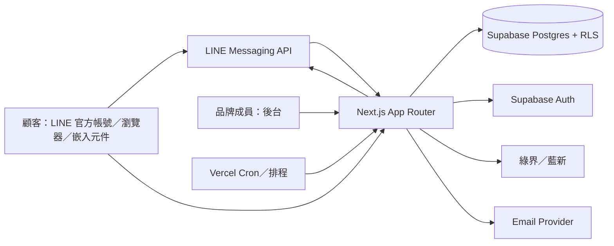

# 預約與報名 SaaS 平台架構

本文件對應 `clinic-booking-spec-v3.md`，描述目前程式庫的目標架構與資料責任。產品保留 `clinic_id` 作為相容租戶鍵，產品語意稱為品牌／租戶。

## Context

## Containers and ownership

| 元件 | 責任 | 不負責 |
|---|---|---|
| 顧客端頁面 | 表單、選擇、狀態顯示、最小資料回傳 | 直接連 Supabase、決定租戶權限 |
| 後台頁面／Server Actions | 成員操作、設定、預約／報名／CRM 管理 | 取代 RLS 或把密鑰送到瀏覽器 |
| API routes | 顧客端寫入、外部 webhook、身份驗證、租戶邊界 | 由 query string 直接信任 `clinic_id` |
| Supabase DB／RPC | 原子名額、狀態機、RLS、冪等、資料保存 | 發送外部訊息 |
| Cron | 提醒、CRM 自動化投遞 | 無租戶範圍地掃描全庫 |
| LINE／金流／Email adapter | 對外請求、回呼驗證、錯誤轉換 | 修改未授權租戶資料 |

## Data boundaries

- 所有業務表帶 `clinic_id`。
- 預約、報名、付款、CRM 投遞與報到分屬不同資料域，不把報名硬塞到 `appointments`。
- 外部回呼先以外部事件識別做冪等，再更新內部狀態。
- 取消／停用保留歷史；不得以 hard delete 取代狀態異動。

## Request flows

### 顧客預約／報名

1. 顧客主要從 Rich Menu postback 進入；服務、日期、活動、票券、會員、客服與品牌資訊先由 LINE 原生訊息承接。
2. 只有時段選擇、必要資料、付款與報到憑證等複雜步驟開啟聚焦 LIFF；瀏覽器與嵌入入口保留完整備援。
3. API 以活動／品牌資料庫關聯決定實際 `clinic_id`，不採信任意前端租戶欄位。
4. LINE 身分以 ID token 或 Account Linking webhook 驗證；非 LINE 流程使用必要的顧客資料與具品牌、顧客及期限簽章的 browser token。
5. API 呼叫受保護的 SQL transaction／RPC 完成名額與狀態變更。
6. 回傳最小必要結果；付款、通知與報到憑證使用不可猜測識別。

### 顧客紀錄與行銷漏斗

1. 預約、報名與會員入口成功後，使用品牌綁定的瀏覽器顧客 token 進入 `/my`。
2. `/api/customer/portal` 只接受 server 產生的 token，回傳目前顧客必要的預約、報名與會員摘要。
3. 公開入口可記錄匿名 `funnel_events`，只用於品牌內群體轉換趨勢，不保存顧客 PII 或可回推的 customer id。
4. CRM Lite 使用顧客同意、規則式分眾與去重投遞紀錄；LINE／Email 失敗不應阻斷另一渠道。

### 後台

1. Supabase Auth 取得 session。
2. `clinic_members` 決定可用品牌與角色；active brand context 必須被 server 驗證。
3. Server Component／Server Action 使用 authenticated client 走 RLS；需要跨表整合時仍必須顯式帶 `clinic_id`。

### 外部回呼

1. 驗證 LINE／金流簽章與必要欄位。
2. 以外部 event id 或訂單號建立冪等紀錄。
3. 只在事件屬於正確品牌且狀態轉移合法時更新資料。
4. 失敗寫入可查詢的錯誤紀錄，回傳外部服務可接受的結果，不讓整批排程中斷。

### LINE 原生互動與客服

1. webhook 以 payload `destination` 取得品牌與該品牌 Vault 憑證；無法對應即拒絕，不回退其他品牌。
2. 每一事件先寫入 `line_webhook_events` 原子認領，重送事件不重複執行取消、綁定、客服或打卡。
3. `line_customer_sessions` 只保存短效意圖、步驟與必要識別，不保存輸入的顧客 PII 或秘密。
4. 後台客服送出時同時呼叫 LINE push；`chat_messages.delivery_status` 明確區分送達與失敗，不以資料庫寫入冒充已送達。
5. 會員綁定使用一次性 link token 與雜湊 nonce；完成後仍以 `clinic_id` 限定顧客，不跨品牌共用。

## Non-functional targets

- RLS、跨品牌拒絕、service-role 不出現在 client 是 P0 安全門檻。
- 預約／報名最後一個名額不得超賣；同一回呼重送不得重複付款確認或通知。
- 顧客端手機優先；表單與互動控制項至少 44px 觸控區域。
- 預設時區 `Asia/Taipei`；資料庫使用 `timestamptz`。
- build、typecheck、migration replay、核心 API smoke path 與 Playwright UI path 必須通過後才能宣稱完成。
- 正式環境的 migration、LINE／Email／金流、DNS 與備份均需以外部系統證據驗收，不以本地 build 代替。
