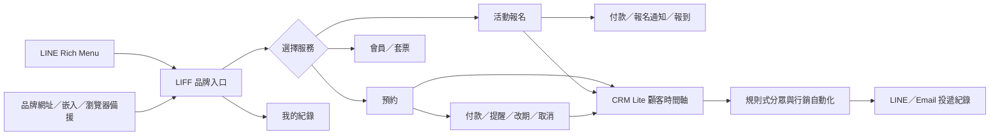

# 產品流程與開發優化驗收基準

更新日期：2026-08-06

本文件把「多品牌預約與報名 SaaS」的產品方向、行銷流程與技術驗收條件收斂成同一份可交接基準。標準功能維持全開放；七項清單外能力只做為另行報價與客製服務，不以方案開關隱藏標準功能。

## 一、產品主流程

設計原則：顧客先理解「我要做什麼」，再進入流程；品牌、活動與顧客資料永遠以目前品牌 context 隔離；所有重要狀態都能在顧客入口、後台與通知中對得上。

## 二、已落地的 P0／P1／P2 補強

| 層級 | 調整 | 驗收證據 |
|---|---|---|
| P0 | 品牌入口不再顯示內部 LINE 設定警告；平台後台與品牌營運後台分開呈現；標準導覽移除叫號入口 | `app/page.tsx`、`components/AdminNav.tsx`、`app/admin/layout.tsx` |
| P0 | 預約、報名、會員使用同一個瀏覽器顧客 token；新增 `/my` 顧客紀錄中心 | `app/api/customer/portal/route.ts`、`app/my/page.tsx` |
| P0 | 報名建立與顧客 `patient_id` 關聯在同一個 DB transaction 完成 | `register_for_event_with_terms(..., p_patient_id)`、`supabase/migration_saas_core_gaps.sql` |
| P0 | 新增顧客身份欄位 migration；舊有報名編號＋電話查詢仍保留作為相容 fallback | `supabase/migrations/202608060001_customer_portal_identity.sql` |
| P1 | 後台總覽改為「今天要處理什麼」：待確認、待付款、通知失敗、未到與未來 7 日 | `app/admin/dashboard/page.tsx` |
| P1 | CRM Lite 分成分眾、自動化、投遞狀態三段；支援預覽、編輯與報表追查 | `app/admin/crm/page.tsx`、`app/admin/reports/page.tsx` |
| P1 | 公開流程加入隱私安全的匿名漏斗事件，不保存姓名、電話、LINE ID 或顧客 ID | `funnel_events`、`app/api/analytics/funnel/route.ts` |
| P2 | 平台管理明確標示 70 項標準功能全開放，七項加購僅作為服務合作標記 | `app/admin/platform/page.tsx`、`lib/platform.ts` |
| P2 | 報表增加預約／報名趨勢、狀態、服務提供者、付款、通知與匿名漏斗 | `app/admin/reports/page.tsx`、`app/admin/dashboard/page.tsx` |

## 三、行銷使用順序與 KPI

CRM Lite 先使用可解釋的資料規則，再啟用單一目的自動化：

1. 顧客同意行銷，且至少有 LINE 或 Email 可投遞。
2. 建立一個可說明的分眾，例如「近 90 天未回訪」或「完成服務後 3 天」。
3. 建立一個單一目的訊息，先預覽再啟用。
4. 觀察送達、失敗、跳過與後續預約／報名，不用發送量當作唯一成功指標。
5. 若要調整內容，先停用舊規則或調整冷卻間隔，避免同一顧客收到重複訊息。

第一階段建議追蹤：入口瀏覽 → 開始預約／報名 → 成功預約／報名、通知送達率、未到率、回訪率。漏斗只作群體趨勢，不作個別顧客追蹤；要做營收歸因、廣告平台回傳或跨品牌報表，列為另行評估的加購能力。

## 四、角色與入口驗收

- 顧客：只透過 LIFF、瀏覽器、自訂品牌網址或嵌入入口使用公開流程；不能讀 Supabase。
- 品牌 owner／admin：管理品牌資料、服務、預約、報名、CRM Lite、報表與通訊設定。
- 櫃檯：處理營運資料與顧客服務，但依個資權限查看必要欄位。
- provider：只看被指派的服務與約診，不取得全品牌顧客名單、付款與 CRM 行銷資料。
- 平台管理員：管理品牌租戶、標準功能服務狀態與加購合作備註，不直接取代品牌成員的日常操作。

## 五、完成前的外部驗收

下列項目不能由本地 build 代替，部署前須在指定 Supabase／Railway／LINE／Email 環境完成：

- 先備份正式資料庫，再依 README 的 migration 順序套用新 migration。
- 驗證 `registrations.patient_id`、`funnel_events` 的 RLS 與 anon REST 讀取為拒絕。
- 以兩個品牌帳號驗證切換後，顧客、報名、付款、CRM 與報表不跨品牌。
- 驗證 LINE LIFF、LINE webhook、Email、Railway Cron 與公開自訂網址。
- 驗證同日新增預約會收到提醒，CRM 投遞失敗可追查，重跑不重複發送。
- 完成手機 390px 與桌面 1440px 的公開入口、顧客紀錄、後台導覽與 CRM 操作檢查。

本文件不把外部帳號、金流測試商店、DNS、Email 網域或正式備份的狀態臆測為已完成；這些必須以實際環境證據結案。
